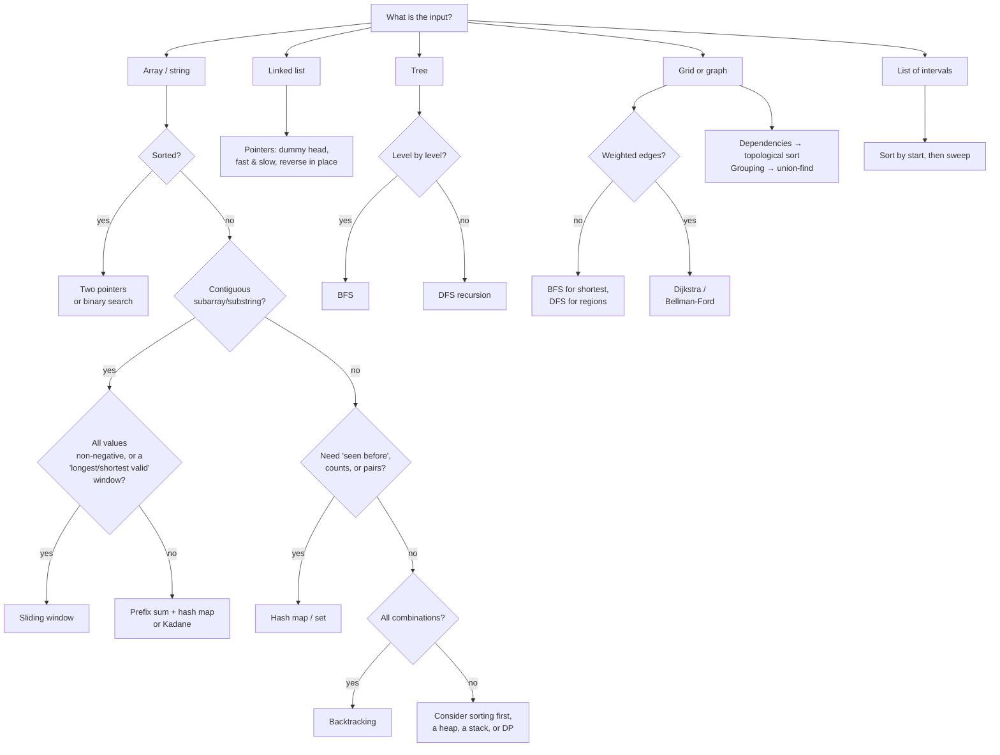

# How to Read a Problem and Pick a Technique

Most people who get stuck on a problem don't lack an algorithm. They picked the **wrong** one,
or they started coding before they understood the question. This guide gives you a fixed routine
for any new problem:

1. **Read** it properly (5 steps, about 5 minutes).
2. **Size** it: turn the constraints into a time budget.
3. **Spot** the signals: words and input shapes that point to a technique.
4. **Pick** a technique, and check it against its closest look-alike.
5. **Test** the idea by hand before writing code.

Every technique here links to its explainer in [`algorithms/`](algorithms/README.md) and to problems
in this repo you can practise it on with `./practice c NNN`.

---

## Part 1: Read the problem properly

Do these five steps **before** you think about algorithms. Write the answers down, as comments at
the top of your solution.

### Step 1: Say it back in one sentence

Put the problem in your own words, without its story. Problems wrap simple questions in stories
about houses, bananas and boats.

> 177 Boats to Save People → *"Split the numbers into as few groups as possible, each group at most
> two numbers with sum ≤ limit."*

If you can't write this sentence, you don't understand the problem yet. Reread it.

### Step 2: Pin down input and output exactly

| Ask | Why it matters |
|---|---|
| What **type** is each input? (array, string, list, tree, grid, graph) | The type limits which techniques are possible |
| Is the array **sorted**? | Sorted input is a strong hint (two pointers, binary search) |
| Can values be **negative**, **zero** or **duplicated**? | Negatives break sliding-window sums; duplicates break "distinct" tricks |
| Do I return a **value**, an **index**, a **count**, a **list**, or **nothing** (in-place)? | Returning indices often rules out sorting |
| Is "subarray/substring" **contiguous**, or is it a **subsequence**? | Contiguous: windows or prefix sums. Subsequence: often DP |
| Is **any** valid answer accepted, or one exact answer? | Tells you whether order and tie-breaking matter |

### Step 3: Read the constraints (they are hints)

The constraints tell you how fast your solution has to be. See Part 2. Also look for:

- **"Values are in the range [1, n]"**: the values can double as indices (cyclic sort, sign marking).
- **"Exactly one solution exists"**: you can stop early and skip checking for "no answer".
- **"O(1) extra space"**: rules out a hash map, so look for pointers, in-place marking or voting.
- **"Lowercase English letters"**: a 26-slot array works as a hash map, so the space is O(1).

### Step 4: Solve the examples by hand

Take the given examples and work them out **on paper, the slow way**. Watch what your brain does:

- Did you **scan left to right while remembering something**? What did you remember? That's your
  data structure.
- Did you **look back** for an earlier value? Use a hash map.
- Did you **compare the two ends**? Use two pointers.
- Did you **try every option** and back out of dead ends? Use backtracking.
- Did you **reuse an answer** to a smaller version? Use DP.

Your manual method is usually the brute force. Part 5 shows how to speed it up.

### Step 5: Hunt the edge cases

Write down at least three before you code:

- Empty or single-element input.
- All values equal; all values distinct.
- Negative numbers, zero, and the largest allowed value (overflow in other languages).
- Already sorted, or reverse sorted.
- No valid answer, or many valid answers.
- The problem's own **EDGE CASES** section (every file in this repo has one).

---

## Part 2: Turn the constraints into a time budget

A judge runs roughly **10⁸ simple operations per second** (JavaScript is a little slower). Find the
size of `n` and read across:

| If n is up to… | You can afford about… | Techniques that usually fit |
|---|---|---|
| 10 – 12 | O(n!) | All permutations, backtracking |
| 20 – 25 | O(2ⁿ) | Subsets, bitmask DP, backtracking |
| 100 – 500 | O(n³) | Triple loops, interval DP |
| 1,000 – 5,000 | O(n²) | Nested loops, 2-D DP (LCS, edit distance) |
| 10⁵ – 10⁶ | O(n log n) or O(n) | Sorting, heaps, binary search, hash maps, two pointers, sliding window, prefix sums |
| 10⁹ and up | O(log n) or O(1) | Binary search on the answer, maths |

**Use it in both directions:**
- `n ≤ 10⁵` means an O(n²) solution (10¹⁰ steps) **will time out**, so don't start with nested
  loops.
- `n ≤ 20` means exponential is expected. Don't waste time hunting for a clever O(n).

In this repo, the `COMPLEXITY → Target` line in each header tells you the budget directly. Try to
work it out yourself first, then check.

---

## Part 3: Spot the signals

### 3a. By the words in the problem

This is the most useful table in the guide. Scan the problem statement for these phrases.

| When the problem says… | Think… | Explainer | Try |
|---|---|---|---|
| "have I **seen** this before", "**duplicate**", "**exists**" | Hash **set** | — | 002, 164 |
| "two numbers that **add up to** target" (unsorted, return indices) | Hash **map** of value → index (look up the complement) | — | 001 |
| "**count** / **frequency** / **how many times**", "**anagram**" | Hash map of counts (or a 26-slot array) | — | 051, 006 |
| "**group** things that are the same in some way" | Hash map from a *canonical key* to a list | — | 005 |
| "**sorted** array", find a **pair/triplet** | Two pointers from both ends | [03](algorithms/03-two-pointers/README.md) | 055, 008, 175 |
| "**palindrome**", "reverse", "compare from both ends" | Two pointers | [03](algorithms/03-two-pointers/README.md) | 007, 171 |
| "**in place**", "**remove**/**move** elements", "O(1) space" | Read/write pointers | [03](algorithms/03-two-pointers/README.md) | 054, 102 |
| "**longest/shortest contiguous** substring/subarray **such that**…" | Sliding window | [05](algorithms/05-sliding-window/README.md) | 012, 057, 013 |
| "every window of size **k**", "**permutation/anagram of p inside s**" | Fixed-size sliding window | [05](algorithms/05-sliding-window/README.md) | 058, 059 |
| "**subarray sum equals k**" (negatives allowed), "sum of a **range**" | Prefix sum (+ hash map) | [06](algorithms/06-prefix-sum/README.md) | 053, 156, 159 |
| "**maximum sum** contiguous subarray" | Kadane's algorithm | [02](algorithms/02-kadanes-algorithm/README.md) | 004, 079 |
| "**sorted**" + "find a position", "**O(log n)**" | Binary search | [07](algorithms/07-binary-search/README.md) | 017, 018 |
| "**minimum** speed/capacity/largest that **still works**" | Binary search **on the answer** | [07](algorithms/07-binary-search/README.md) | 065, 109 |
| "**next greater/smaller**", "how many days until **warmer**", "**span**" | Monotonic stack | [10](algorithms/10-monotonic-stack/README.md) | 062, 060, 016 |
| "**valid parentheses**", "**nested**", "decode", "undo", "evaluate expression" | Stack | — | 014, 104, 061 |
| "**cycle** in a linked list", "**middle** of a list", "repeats forever?" | Fast & slow pointers | [04](algorithms/04-fast-and-slow-pointers/README.md) | 022, 160 |
| "**majority**", "appears **more than n/2** (n/3) times" | Boyer-Moore voting | [01](algorithms/01-boyer-moore-voting/README.md) | 101, 167 |
| "values in **[1, n]**", "**missing**/**duplicate** number", O(1) space | Cyclic sort / sign marking | [09](algorithms/09-cyclic-sort/README.md) | 166, 168, 169 |
| "every element appears **twice except one**" | XOR | [20](algorithms/20-xor-tricks/README.md) | 046, 089 |
| "sort **0s, 1s and 2s**", "partition into three groups" | Dutch national flag | [08](algorithms/08-dutch-national-flag/README.md) | 056 |
| "**rotate** an array", "next **permutation**" in place | Reversal | [21](algorithms/21-reversal-algorithm/README.md) | 103, 178 |
| "**k-th largest**", "**top k**", "**k closest**" | Heap of size k (or quickselect) | [23](algorithms/23-heap-top-k/README.md), [19](algorithms/19-quickselect/README.md) | 092, 006, 093 |
| "**median** of a stream", "keep adding numbers and ask…" | Two heaps | — | 094 |
| "**intervals**", "meetings", "**overlap**", "merge ranges" | Sort by start, then sweep | [22](algorithms/22-interval-merging/README.md) | 043, 085, 045 |
| "**islands**", "connected region", "flood fill" on a grid | DFS or BFS | [11](algorithms/11-bfs-and-dfs/README.md) | 029, 073 |
| "**minimum steps/moves**" with **no weights**, "spreads each minute" | BFS (level by level, multi-source) | [11](algorithms/11-bfs-and-dfs/README.md) | 074, 118 |
| "**prerequisites**", "**order** tasks by dependencies", "is it possible to finish" | Topological sort | [12](algorithms/12-topological-sort/README.md) | 030, 147 |
| "**connected components**", "are these in the **same group**", "extra edge makes a cycle" | Union-find | [13](algorithms/13-union-find/README.md) | 143, 145 |
| "**shortest/cheapest path**" with **non-negative weights** | Dijkstra | [14](algorithms/14-dijkstra/README.md) | 148 |
| "cheapest path with **at most k** stops/edges" | Bellman-Ford (k rounds) | [15](algorithms/15-bellman-ford/README.md) | 150 |
| "connect **all** points with **minimum total cost**" | Minimum spanning tree (Prim / Kruskal) | [16](algorithms/16-prims-mst/README.md) | 149 |
| "return **all** subsets/permutations/combinations", "**generate** every…" | Backtracking | [17](algorithms/17-backtracking/README.md) | 040, 041, 082 |
| "**number of ways**", "**minimum cost** to reach", "**maximum** you can get", with choices at each step | Dynamic programming | — | 033, 034, 036 |
| two strings, "**longest common**", "**edit** distance", "is s a subsequence…" | 2-D DP (or two pointers for the simple case) | — | 038, 039, 173 |
| "**can you reach** the end", "**minimum** number of … greedy-looking" | Greedy (prove it!) | — | 044, 086, 177 |
| "**prefix** of words", "autocomplete", "search many words in a board" | Trie | — | 095, 097 |
| "**primes** up to n" | Sieve of Eratosthenes | [18](algorithms/18-sieve-of-eratosthenes/README.md) | 162 |
| tree problem: "depth", "path", "is it balanced", "same tree" | DFS recursion (return info up) | — | 025, 070, 072 |
| tree problem: "**level by level**", "right side view" | BFS with a queue | [11](algorithms/11-bfs-and-dfs/README.md) | 028, 114 |

### 3b. By the shape of the input

When the wording doesn't give it away, start from what you were handed:



### 3c. By what the answer looks like

| The answer is… | Usually… |
|---|---|
| A **boolean** ("is it possible") | Hash set, two pointers, graph search, or DP on reachability |
| A **count** of ways | DP (or prefix sum + hash map for subarray counts) |
| A **min/max** value | DP, greedy, sliding window, Kadane, or binary search on the answer |
| **All** solutions as a list | Backtracking (the output alone is exponential, so no faster method exists) |
| The **k-th / top k** | Heap, quickselect, or bucket sort |
| An **ordering** | Sorting, topological sort, monotonic stack |

---

## Part 4: Tell the look-alikes apart

Most wrong picks come from confusing two techniques that fit the same words. Check these pairs.

### Hash map vs sort + two pointers
Both solve "find two numbers that add up to target".
- **Need original indices?** Sorting scrambles them, so use a **hash map** (001).
- **Already sorted, or O(1) space required?** Use **two pointers** (055).
- **Need unique triplets/quadruplets?** **Sort + two pointers** makes skipping duplicates easy (008, 176).

### Sliding window vs prefix sum
Both handle contiguous subarrays.
- A sliding window only works if **growing the window never makes a broken window valid again**, or
  more precisely, if the condition changes in one direction as the window grows. With **all
  non-negative** numbers, adding an element only increases the sum, so the window works.
- **Negatives allowed** + "sum equals k" means the window breaks, so use **prefix sum + hash map** (053).
- "**Longest substring with at most/without** …" is the classic sliding window (012, 057).

### Two pointers vs sliding window
- **Two pointers** usually start at **opposite ends** and move toward each other. They compare
  elements; they don't maintain a range.
- **Sliding window** pointers both move **left to right**, and you track the contents **between**
  them (a sum, counts, a set).

### Binary search: on the array, or on the answer?
- The array is sorted and you look for an element: **classic** (017).
- The array isn't sorted, but you can ask "**does value X work?**", and every value past the first
  working one also works: search **the range of answers** (065 Koko: can she finish at speed X?).

### BFS vs DFS
- **Shortest** number of steps in an unweighted graph or grid: **BFS** (DFS does not give the shortest).
- **Explore/count** regions, detect cycles, try all paths: **DFS** is simpler.
- A **level-by-level** answer ("each minute", "each level"): **BFS**.

### Dijkstra vs BFS vs Bellman-Ford
- All edges cost the same: **BFS**.
- Different non-negative weights: **Dijkstra**.
- Negative weights, or a **limit on the number of edges**: **Bellman-Ford** (150).

### Greedy vs DP vs backtracking
- **Backtracking**: you must **list every** solution, or n is tiny.
- **DP**: you need the best/count, and the same **subproblem repeats** (a smaller amount, a shorter
  prefix, a smaller index).
- **Greedy**: a locally best choice is **provably** never wrong. Try to break your greedy rule with a
  small counterexample. If you can, switch to DP (e.g. greedy coin change fails for coins
  `[1, 3, 4]`, amount 6).

### Heap vs sort vs quickselect for "k-th / top k"
- Sort: O(n log n), simplest. Fine when n is small.
- Heap of size k: O(n log k). Best when **k ≪ n** or data arrives as a **stream**.
- Quickselect: O(n) on average. Best for a **single** k-th element when you can reorder the array.

### `for` vs `while`: which loop?
Once you know the technique, the loop shape follows from it. Ask one question: **does something
advance by a fixed step on every single iteration?**
- **Yes:** that thing is the `for` variable. Every other pointer is a plain variable that moves in
  the body.
- **No:** a comparison picks which pointer moves, or the loop stops on a condition you can't count
  in advance. Use **`while`**.

Almost every problem in this repo uses one of these six shapes:

| Shape | Looks like | Use it when | Techniques |
|:------|:-----------|:------------|:-----------|
| Plain `for` | `for (i …)` | Every element is visited once, in order | Kadane, Boyer-Moore, prefix sum, XOR, interval merge, heap top-k |
| `for` + a lagging pointer | `for (read …) { if (keep) write++ }` | One pointer always moves, the other only sometimes | Read/write two pointers (054, 102), 173, Lomuto partition |
| `for` + inner `while` | `for (r …) { while (bad) l++ }` | One side always grows, the other catches up zero or more times | Sliding window, monotonic stack |
| `while` | `while (l < r)`, `while (lo <= hi)`, `while (queue.length)` | A comparison decides the move, or the end is a condition | Converging two pointers, binary search, Dutch flag, cyclic sort, fast & slow, BFS, Dijkstra, union-find `find` |
| `for` over rounds | `for (round < k) { for (edge …) }` | A whole pass repeats a known number of times | Bellman-Ford, sieve |
| Recursion + `for` | `explore() { for (choice …) explore() }` | Try every choice at every depth | Backtracking, recursive DFS |

Quick checks:
- **Some branch must not move the index** (Dutch flag's high case, cyclic sort's swap)? Use
  `while`. A `for` would move the index anyway.
- **"Scan until you find"** (the next permutation pivot, skipping non-letters in a palindrome)? That's a
  `while` on the condition.
- **Nested doesn't always mean O(n²).** If the inner `while` only pushes a pointer forward and it
  never resets, the total work is O(n).
- **The loop condition must match what the pointers mean.** Before writing `l < r` or `l <= r`,
  `lo < hi` or `lo <= hi`, say in one sentence what the bounds mean.

Every [algorithm explainer](algorithms/README.md) has a **Loop shape** section with the details
for that technique.

---

## Part 5: When no technique jumps out

Don't sit waiting for inspiration. Go through these steps:

1. **Write the brute force** in words. Nested loops, try everything. Work out its complexity.
2. **Compare it with the budget** from Part 2. If it fits, code it.
3. **Find the repeated work.** What does the inner loop recompute every time?
   - It **searches** for a value → a **hash map** remembers it (O(n) → O(1) lookup).
   - It **re-sums** a range → **prefix sums** or a **sliding window**.
   - It **re-scans** for the next bigger element → a **monotonic stack**.
   - It **re-solves** the same smaller problem → **DP / memoisation**.
   - It re-finds the **min/max** of a changing set → a **heap**.
4. **Try sorting first.** Many O(n²) problems become O(n log n) once the input is sorted.
5. **Draw it.** Pointers on an array, a small graph, a DP table. Patterns show up on paper.
6. **Shrink the problem.** Solve it for n = 1, 2, 3. How does the answer for n build on n − 1?
   That relation is your DP.

---

## Part 6: Walk-throughs

Here is the full routine on four problems from this repo. **Spoiler warning:** each one names the
technique. Try the routine yourself before reading.

### 164 Contains Duplicate II
1. **Restate:** is there a pair of equal values at most k positions apart?
2. **Input/output:** unsorted array + k; return a boolean. Indices matter (distance), so don't sort.
3. **Constraints:** n ≤ 10⁵ → O(n²) is too slow; aim for O(n).
4. **By hand:** scanning left to right, I ask "did I see this value **recently**?", which is a
   "seen before" signal → hash map/set.
5. **Refine:** "recently" means only the last k values matter → keep a set of the last k (a
   fixed-size **sliding window** of seen values), or a map of value → last index.

### 053 Subarray Sum Equals K
1. **Restate:** count contiguous subarrays whose sum is exactly k.
2. **Input:** values **can be negative**. That's the key detail.
3. **Constraints:** n ≤ 2·10⁴. O(n²) is borderline, and O(n) is expected.
4. **Signals:** "contiguous subarray" + "sum" suggests a sliding window, **but** negatives break it
   (Part 4).
5. **Pick:** sum(i..j) = prefix[j] − prefix[i−1], so count earlier prefixes equal to
   `prefix − k` → **prefix sum + hash map of counts**.

### 065 Koko Eating Bananas
1. **Restate:** find the smallest eating speed that finishes all piles within h hours.
2. **Input:** piles are unsorted, but the **answer** is a number in `[1, max pile]`.
3. **Constraints:** piles up to 10⁹ → trying every speed is too slow.
4. **Signal:** "**minimum** speed such that it **still works**". If speed X works, every speed
   above X works too.
5. **Pick:** **binary search on the answer**, with an O(n) "does this speed finish in time?" check
   → O(n log max).

### 177 Boats to Save People
1. **Restate:** pair up numbers (at most 2 per group, sum ≤ limit) to use as few groups as possible.
2. **Input:** unsorted weights, return a count. Order and indices don't matter, so **sorting is allowed**.
3. **Constraints:** n ≤ 5·10⁴ → O(n log n).
4. **By hand:** the heaviest person needs a boat anyway; the best partner is the lightest person.
   That's a **greedy** choice.
5. **Pick:** **sort + two pointers** (heaviest from the right, lightest from the left).
   **Check the greedy:** if even the lightest can't ride with the heaviest, nobody can.

---

## Patterns to remember

Add a line here whenever a problem's wording should point you straight at a technique.

- "**rotate** an array" → **reversal algorithm** ([21](algorithms/21-reversal-algorithm/README.md)) — 103

---

## The one-page checklist

Copy this into the top of your solution file for your first 20 problems:

```
// 1. In one sentence:
// 2. Input types / sorted? / negatives? / duplicates?
//    Output: value | index | count | list | in-place
// 3. n up to ____  →  budget O(____)
//    Special constraints (range [1,n], O(1) space, unique answer):
// 4. Signal words spotted:
//    Input shape:
//    Technique candidates:        vs look-alike:
// 5. Brute force + complexity:
//    Repeated work to remove:
// 6. Edge cases: empty/single, all same, negatives, no answer
// 7. Loop shape: for | for + lagging ptr | for + inner while | while | rounds | recursion
```

Once the routine becomes automatic, you'll find you recognise most problems by step 4.
